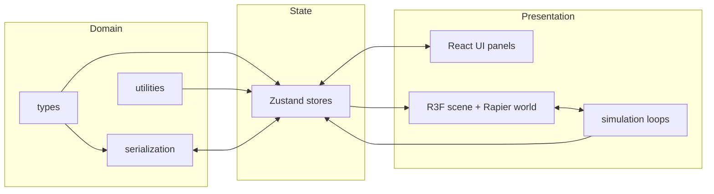

# Technical Design

How the simulator is built. The functional scope lives in `PRODUCT_SCOPE.md`; decisions and their rationale live in `DECISIONS.md`. This document describes the intended end-state architecture — the roadmap (`ROADMAP.md`) records how much of it exists today.

## Technology Stack

- **TypeScript** (strict mode) throughout; no plain JS source files.
- **React 19 + Vite 7** for the application shell and build.
- **three.js via React Three Fiber (R3F)** for rendering; `@react-three/drei` for camera controls, grid, and helpers.
- **Rapier** physics (Rust compiled to WebAssembly) via `@react-three/rapier`.
- **Zustand** for application state.
- **Vitest** for unit tests, **ESLint + Prettier** for quality.

See ADR-001…ADR-007 in `DECISIONS.md` for why each was chosen.

## Overall Application Architecture

Three layers with one-way knowledge:

1. **Domain layer** (`src/types`, `src/utilities`, `src/serialization`) — pure TypeScript, no React/three/Rapier imports. Defines scene elements, settings, unit conversions, save format. Fully unit-testable.
2. **State layer** (`src/state`) — Zustand stores holding the *design-time* description of the scene (elements + properties), simulation settings, UI state (selection, placement mode), and live statistics. Stores contain plain data, never three.js or Rapier objects.
3. **Presentation/simulation layer** (`src/app`, `src/components`, `src/rendering`, `src/physics`, `src/simulation`, `src/elements`) — React components subscribe to the stores and materialise elements into meshes and physics bodies. Runtime physics objects live inside the R3F/Rapier component tree, keyed by element ID.



The scene description in the store is the single source of truth. Rendering and physics are derived from it; they never own design-time data.

## Rendering Architecture

- One R3F `<Canvas>` fills the viewport. Inside it: lighting, an infinite grid + ground plane, `<OrbitControls>` (drei), and one React component per placed element (`src/rendering`/`src/elements`).
- Element meshes are cheap primitives (boxes, extrusions). Selection is shown with an outline/emissive highlight.
- **Crops are rendered with `InstancedMesh`** — one instanced mesh per crop type, capacity equal to the pool size. Each frame, instance matrices are copied from the Rapier bodies of live crops. Dead pool slots are collapsed to zero scale.
- Target: one draw call per crop type regardless of crop count.

## Physics Architecture

- One Rapier world (`<Physics>` from `@react-three/rapier`) wraps the scene content.
- **Machines** are `fixed` rigid bodies with cuboid/compound colliders. Belts additionally set a **contact surface velocity** on their top collider — the belt geometry never moves (ADR-006).
- **Crops** are dynamic rigid bodies (ball or capsule colliders) drawn from a fixed-size pool.
- **Sensors** (intersection-only colliders) implement spawner volumes, elevator intakes, collection zones, despawn zones, and floor-contact detection.
- Collision layers separate crops, machines, and sensors — see `PHYSICS_SPECIFICATION.md` for the exact interaction matrix and material parameters.

## State Management

Zustand stores, kept small and focused:

- `sceneStore` — placed elements (`Record<ElementId, SceneElement>`), add/update/remove/duplicate actions, scene metadata.
- `simulationStore` — running/paused, simulation settings (gravity, crop cap), and live statistics (updated at ~4 Hz, not per frame, to avoid re-render storms).
- `uiStore` — selection, placement mode, panel visibility, camera state snapshot for saving.

Rules: store data is serialisable plain objects only; components subscribe with selectors; per-frame data (body transforms) bypasses the store entirely and flows directly from Rapier to the instanced mesh inside `useFrame`.

## Coordinate System

- three.js convention: **right-handed, Y-up**. X = "east", Z = "south", ground plane is XZ at y = 0.
- An element's **forward/flow direction is its local +X axis**; rotation is a single **yaw** angle in radians, counter-clockwise about +Y when viewed from above. Yaw 0 means flow along world +X.
- Element `position` refers to the element's **origin point documented per element type** in `DOMAIN_MODEL.md` (generally the centre of the footprint at ground level).

## Unit Conventions

- **1 world unit = 1 metre** (ADR-003). All lengths in metres, masses in kilograms, time in seconds, angles in radians internally (degrees only at the UI edge).
- Throughput is stored in **tonnes per hour** (the user-facing unit) and converted at the point of use. Belt speed is stored in **metres per minute** (industry-familiar) and converted to m/s for physics. Conversion helpers live in `src/utilities/flow.ts` and are unit-tested; nothing else may hand-roll these conversions. See `DOMAIN_MODEL.md` for the full unit glossary.

## Physics Timestep

- **Fixed timestep, 1/60 s** (`timeStep={1/60}` on `<Physics>`), with `@react-three/rapier` accumulating render-frame time and stepping 0–N times per frame; rendering interpolates between steps (ADR-004).
- Simulation logic that accumulates over time (spawn-rate accumulator, despawn timers) hooks the physics step (fixed-step callbacks), not the render frame, so behaviour is frame-rate independent.
- A cap of 3 catch-up steps per render frame prevents the spiral of death on slow machines; excess time is dropped (simulation slows rather than freezes).

## Conveyor Motion

Belts do not move geometrically. Each belt's top-surface collider is assigned a contact surface velocity of `beltSpeed` (m/s) along the element's local +X, rotated by yaw into world space. Rapier's contact solver then drags any body resting on that collider as though the surface were moving. Inclined belts rotate the surface-velocity vector with the belt pitch so crops are carried up the slope. Full behavioural detail: `PHYSICS_SPECIFICATION.md`; rationale and rejected alternatives: ADR-006.

## Crop Spawning Calculation

For a spawner with target throughput `Q` (t/h) and crop type of mass `m` (kg):

```text
massRate  = Q * 1000 / 3600        // kg/s
cropsPerSecond = massRate / m      // crops/s
```

Each fixed physics step (`dt`), the spawner accumulates `cropsPerSecond * dt` into a fractional accumulator and spawns `floor(accumulator)` crops, keeping the remainder. This makes the long-run average exact even when `cropsPerSecond * dt < 1`. Implemented in `src/utilities/flow.ts` + `src/simulation/spawning.ts`; unit-tested.

## Object Pooling

- A `CropPool` pre-allocates `maxActiveCrops` (default 2 000) slots at world creation: rigid body + collider + instanced-mesh slot each, created once and reused.
- Inactive bodies are disabled (`setEnabled(false)`) and parked far below the floor; their instance scale is zeroed.
- `acquire()` returns `null` when exhausted — spawners treat that as throttling, never allocate. `release()` resets velocity/forces and disables the body.
- Pool avoids per-crop GC pressure and WASM allocation churn (ADR-005).

## Save-File Architecture

- `src/serialization` converts between store state and the versioned JSON format defined in `SAVE_FILE_FORMAT.md` / `schemas/layout.schema.json`.
- `serializeLayout(state) → LayoutFileV1` and `parseLayout(json) → Result<LayoutFileV1, ParseError[]>` are pure functions (unit-testable, no DOM).
- Loading: parse JSON → check `fileVersion` → run migrations old→new one version at a time → validate → replace store state atomically. Any error aborts before the store is touched.
- File I/O (download blob / file picker) is a thin layer in `src/components` on top of the pure functions.

## Error Handling

- **Load errors**: schema/parse failures surface as a dismissible error dialog listing each problem (path + message); current scene untouched.
- **Physics/WASM init failure**: detected at startup; the app renders a full-screen message with browser requirements instead of a broken canvas.
- **React errors**: an error boundary around the canvas and one around the panels, so a rendering crash cannot take out the whole UI.
- **Property validation**: inputs are clamped/validated at the UI edge (see `UI_UX_SPECIFICATION.md`); the store only ever contains valid values, so deeper layers do not re-validate.
- No `console.log` in committed code; use `console.warn/error` for genuinely exceptional conditions.

## Testing Strategy

- **Unit tests (Vitest)** for all pure logic: unit conversions, spawn accumulator, ID generation, serialization round-trip, migrations, schema examples. These run in CI on every push.
- **Component smoke tests** where cheap (panels render, store actions mutate correctly).
- **Physics/rendering are verified manually** against the acceptance criteria in `ROADMAP.md` per stage; browser-automation tests are a possible later addition. Rationale: R3F + WASM physics in jsdom is high-effort/low-signal.
- Test files live beside their subject (`foo.ts` / `foo.test.ts`); shared fixtures in `src/tests`.

## Performance Strategy

- Instanced crop rendering (one draw call per crop type).
- Object pooling; hard active-body cap with spawner throttling.
- Rapier body sleeping enabled — settled crops stop consuming solver time.
- Statistics UI updates at ~4 Hz; per-frame data never flows through React state.
- Simple collider shapes only (balls/capsules/cuboids); no trimesh colliders for crops.
- If needed later: reduce solver iterations, lower crop cap on weak devices, LOD for distant crops.

## Extension Points for Future Equipment

- Every element type implements a common contract in `src/elements`: a **type descriptor** (id, label, default properties, property schema for the editor) plus a **React component** rendering mesh + colliders from its properties.
- The element library panel, properties panel, serializer, and scene renderer are all driven by a registry of descriptors — adding an auger means adding one descriptor + component + schema entry, with no changes to panels or serialization plumbing.
- Equipment-specific properties are namespaced per element type in the save format (`SAVE_FILE_FORMAT.md`) so new types are additive, not breaking.
